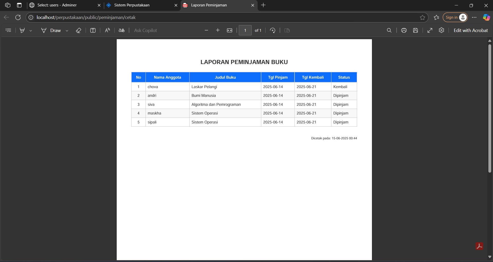

# Sistem Informasi Perpustakaan

## 📝 Deskripsi Proyek

Sistem Informasi Perpustakaan ini dirancang untuk memudahkan proses pengelolaan buku, anggota, dan transaksi peminjaman di lingkungan sekolah atau institusi pendidikan. Aplikasi ini dibangun menggunakan framework CodeIgniter 4 dan mengusung antarmuka modern dengan menggunakan template dashboard admin Mantis, berbasis Bootstrap 5. Pada bagian frontend ini dibangun dan didesain sendiri, dan menggunakan Bootstrap 5 sebagai pemanis UI frontend.

## 🧰 Teknologi yang Digunakan

- Backend: PHP 8.x, CodeIgniter 4
- Frontend: HTML, CSS (menggunakan Bootstrap 5 sebagai framework CSS modern), JavaScript, AOS
- Database: MySQL
- Server: Laragon
- Library Tambahan: Dompdf (untuk cetak PDF)

## ✨ Fitur Utama

- Halaman publik (guest): Home, Katalog Buku, Kontak
- Manajemen data CRUD:
  - Buku
  - Anggota
  - Peminjaman & Pengembalian
- Dashboard statistik
- Flash message & validasi form otomatis
- Responsive UI/UX berbasis Mantis

## 🌐 Fitur Tambahan

- Menggunakan Boostrap 5 sebagai CSS
- Autentikasi login admin
- Cetak laporan PDF
- Google Maps embed lokasi sekolah
- Smooth scroll, animasi AOS, scroll to top
- Navigasi responsif dan fixed navbar

## 🚀 Cara Menjalankan Aplikasi

1. Clone atau download repository ini
2. Salin semua file ke dalam direktori www/ (untuk Laragon) atau direktori web server Anda.
3. pastikan folder perpustakaan berada di C:\laragon\www\. 
4. Import file `db_perpus.sql`, file `db_perpus.sql` berada didalam folder Database_SQL.
5. Tidak di sarankan mengedit nama folder utama `perpustakaan`, jika diubah pastikan anda mengedit pada bagian BaseURL yang berada di Config App.
6. Jalankan di local server (`http://localhost/perpustakaan/public`)
7. Untuk mengakses dashboard admin, login menggunakan :

- Username : admin
- Password : maskha

## 🖼️ Screenshot Aplikasi

### Halaman Utama

### Tampilan Login

### Dashboard Admin

### Fitur Tampilan Kelola Buku (CRUD)

### Fitur Tampilan Kelola Anggota (CRUD)

### Fitur Tampilan Peminjaman

### Cetak Laporan PDF

# UAS-TWEB-MASKHA-FORELLA
